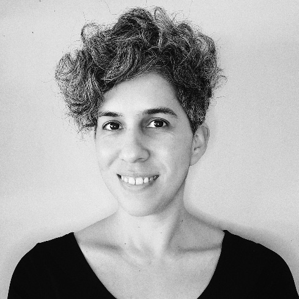
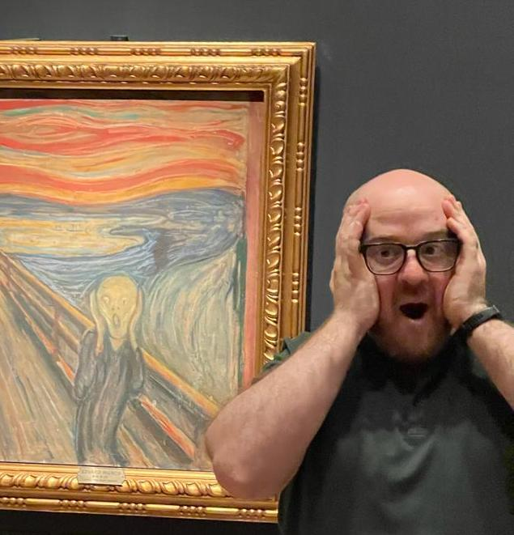

Este evento es organizado por la Red de Humanidades Digitales de Chile, en colaboración con el [Laboratorio de Patrimonio Documental y Humanidades Digitales UC](https://centropatrimonio.uc.cl/iniciativas/laboratorio-de-humanidades-digitales/).

::: {.org-logos}


:::

::: {.team-grid}

::: {.team-member}
{.team-photo}

::: {.team-name}
Nicole Larrondo
:::

Nicole Larrondo es Doctora en Estudios Culturales Latinoamericanos por la Universidad de Texas en Austin y Master en Humanidades Públicas por Brown University. Actualmente es la coordinadora de Humanidades Digitales en el [Laboratorio de Historia Digital]() y en el [Laboratorio de Patrimonio Documental y Humanidades Digitales](https://laboratoriopatrimonioyhumanidades.uc.cl/) de la Pontificia Universidad Católica de Chile.

::: {.social-links}
[](https://www.linkedin.com/in/nicole-larrondo-p/) 
:::

:::

::: {.team-member}
{.team-photo}

::: {.team-name}
Riva Quiroga
:::

Riva Quiroga es Doctora en Lingüística. Actualmente trabaja como Research Fellow en [OLS](https://we-are-ols.org/) y es parte del equipo detrás de [Programming Historian](https://programminghistorian.org/). Es Fellow del [Software Sustainability Institute](https://www.software.ac.uk/) y participa de forma activa en distintas comunidades de programación y ciencia abierta.

::: {.social-links}
[](https://rivaquiroga.cl) | [](https://linkedin.com/in/riva-quiroga) | [](https://github.com/rivaquiroga) | [](https://bsky.app/profile/rivaquiroga.bsky.social) | [](https://orcid.org/0000-0002-1147-4135)
:::

:::

::: {.team-member}
{.team-photo}

::: {.team-name}
James Staig
:::

James Staig es Doctor en Literatura especializado en la relación entre sonido, literatura y accesibilidad. Ha desarrollado proyectos culturales y de investigación que cruzan tecnología, pedagogía y creación literaria.

::: {.social-links}
[](https://cl.linkedin.com/in/james-staig-limidoro) | [](https://orcid.org/0000-0001-8947-0719) 
:::

:::

:::

# Colaboran


```{r obtener-datos-colaboradores}
#| echo: false
#| warning: false
#| message: false

source("R/utils.R")

gs4_deauth()

url_hoja <- "https://docs.google.com/spreadsheets/d/10CI16PtJPUO5M_sz1bMJeDuIj4QN9phG-DRlhqD51C0/edit?usp=sharing"
datos_colaboradores <- read_sheet(url_hoja, sheet = "equipo")

datos_colaboradores <- datos_colaboradores |>
  mutate(
    foto_path = ifelse(
      is.na(foto) | foto == "",
      "img/equipo/default-avatar.svg",
      paste0("img/equipo/", foto)
    ),
    bio = ifelse(is.na(bio), "", bio),
    nombre = ifelse(is.na(nombre), "", nombre)
  )
```


```{r render-colaboradores}
#| echo: false
#| warning: false
#| message: false
#| results: asis

# Colaboradores: tarjeta estilo team-member
colaboradores <- datos_colaboradores |> filter(tipo == "colaboradores")
if (nrow(colaboradores) > 0) {
  html_cards <- colaboradores |>
    rowwise() |>
    mutate(html = generar_div_colaborador(foto_path, nombre, bio)) |>
    pull(html) |>
    paste(collapse = "\n\n")
  cat('::: {.team-grid}\n\n')
  cat(html_cards)
  cat('\n\n:::\n\n')
}


```

# Ayudantes
<br/>

<div id="ayudantes-lista">

```{r}
#| echo: false
#| warning: false
#| message: false
#| results: asis

# Ayudantes: estilo presentador
ayudantes <- datos_colaboradores |> filter(tipo == "ayudantes")
if (nrow(ayudantes) > 0) {
  html_ayudantes <- ayudantes |>
    rowwise() |>
    mutate(html = generar_div_presentador(foto_path, nombre, bio)) |>
    pull(html) |>
    paste(collapse = "\n\n")
  cat(html_ayudantes)
}
```

</div>

<script>
  document.addEventListener("DOMContentLoaded", function() {
    const lista = document.getElementById("ayudantes-lista");
    const items = Array.from(lista.querySelectorAll(".presentador-item"));
    for (let i = items.length - 1; i > 0; i--) {
      const j = Math.floor(Math.random() * (i + 1));
      lista.appendChild(items[j]);
      items.splice(j, 1);
    }
  });
</script>