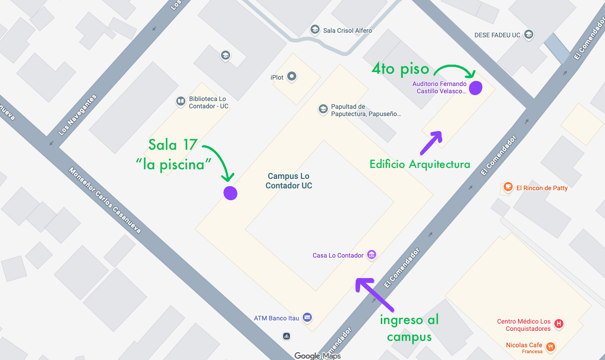

El día jueves 9 de abril las actividades se ralizarán de forma presencial en el [campus Lo Contador de la UC](https://maps.app.goo.gl/NFuyiH5Yqaehf3iW9), en los siguientes espacios:

- Edificio de Arquitectura:
    - Hall piso 1
    - Auditorio piso 4 (Eduardo Castillo Velasco)
    - Terraza piso 4 
- Sala 17: también conocida como "La Piscina"

La estación de metro más cercana es Pedro de Valdivia, que se encuentra a ~10 minutos caminando. 